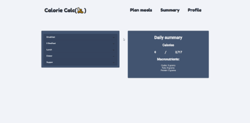

# CalorieCalculator

**Calories counting app inspired by Fitatu.**

# Demo

https://calorie-calculator.netlify.app/

# About
App was made using Edamam @ https://www.edamam.com/ and Angular Material @https://material.angular.io/ components.
Users can add food to list of meals, and application will count calories and basic macronutriens.
Additionaly app stores up to 30 entries into the local storage using it as a CRUD service. That functionality is used to mock client-server communication.
Lastly users can calculate daily calories intake based on their input.

# Technologies
- Angular
- Angular Material
- Netlify (hosting demo)
- Edamam API
- LocalStorage API(mock server)

# Things to be done
- reworking mat dialog to be RWD
- catching errors
- write tests
- add more types

# Notes 
- Edamam free plan allows only for 10 request per minute

# Known issues
- mat-expansion-panel compatibility https://github.com/angular/components/issues/11765

# Credits

Forumula for calculating daily intake: https://www.calculator.net/calorie-calculator.html
Code-reviews thanks to discord community: https://typeofweb.com/polski-frontend-discord/
